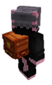
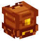
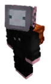

<p align="center">
  
  
  
</p>

<h1 align="center">🎒 HeadBackpacks</h1>

<p align="center">
  A complete customizable backpack plugin for Minecraft servers using player heads.
</p>

---

## ✨ Features

- 🎨 **Fully customizable backpacks** - Names, lore, textures, and sizes
- 📦 **Custom crafting system** - Define your own recipes
- ⬆️ **Upgrade system** - Create upgraded backpacks using other backpacks in recipes
- 🗺️ **World placement** - Optionally place backpacks as blocks while maintaining their contents
- 🎭 **Custom textures** - Each backpack can have its own texture or use a default one
- 🖌️ **Player texture customization** - Players can personalize their backpack texture with a command
- 💾 **Data persistence** - Content is automatically saved
- ✏️ **Anvil renaming** - Rename your backpacks in an anvil while preserving all functionality
- 🔒 **Permission system** - Configurable permissions for commands
- 🌍 **Multi-language support** - Available in 7 languages (en, es, pt, de, fr, zh, ru)
- 📂 **Inventory quick-open** - Right-click backpacks directly from your inventory
- 🎯 **Smart interaction** - Prioritizes interactable blocks (chests, doors, etc.) over opening backpacks
- 🛡️ **Anti-nesting protection** - Backpacks cannot be placed inside other backpacks
- 🚫 **Non-stackable** - Each backpack is unique and cannot be stacked
- 👕 **Wearable as chestplate** - Equip backpacks in the chest armor slot
- 🎨 **Visual rendering (BETA)** - Optional 3D backpack rendering on players' backs when equipped

## 🎯 Preview

<p align="center">
  
</p>

## 📋 Requirements

- ☕ Java 21 or higher
- 🎮 **Bukkit/Spigot/Paper 1.21.4+** or compatible forks
  - ✅ **Compatible with**: Bukkit, Spigot, Paper, Purpur, Folia, and other forks

## 🎮 Commands

| Command | Description | Permission |
|---------|-------------|------------|
| `/backpack` | Shows available options | `headbackpacks.use` |
| `/backpack list` | Lists all available backpacks | `headbackpacks.use` |
| `/backpack give <id>` | Gives a backpack to a player | `headbackpacks.give` |
| `/backpack texture <url>` | Customize backpack texture (hold 1 backpack) | `headbackpacks.texture` |


### Opening Backpacks
- **From hand**: Hold the backpack and right-click
- **From inventory**: Right-click the backpack directly in your inventory

> ⚠️ **Note**: Backpacks cannot be placed inside other backpacks

### Smart Interaction
When holding a backpack and right-clicking on interactable blocks (chests, furnaces, doors, trapdoors, etc.), the block will be interacted with instead of opening the backpack.

### World Placement
If `AllowPlaceBackpacks: true`, you can place backpacks in the world. When broken, they will drop with all their contents preserved.

### Customization
- **Anvil**: Rename your backpack in an anvil (preserves all data)
- **Texture**: Use `/backpack texture <url>` to change your backpack's appearance

## ⚙️ Configuration

### Language

```yaml
#Available languages: en, es, pt, de, fr, zh, ru
Language: 'en'
```

Language files are located in `plugins/HeadBackpacks/lang/` and can be customized.

### Permissions

```yaml
Permission: 'headbackpacks.use'
GivePermission: 'headbackpacks.give'
TexturePermission: 'headbackpacks.texture'
```

### World Placement & Wearing

```yaml
AllowPlaceBackpacks: true  # Allow placing backpacks as blocks
AllowWearBackpacks: true   # Allow wearing backpacks in the chest slot
```

### Visual Rendering (BETA)

```yaml
EnableVisualBackpacks: false  # BETA: Render backpacks visually on players' backs when equipped
```

> ⚠️ **Beta Feature**: Visual rendering is experimental and may have performance impacts. It's disabled by default. When enabled, backpacks will appear as 3D models on players' backs when equipped in the chest slot. The rendering automatically adjusts based on player movement and body direction.

### Default Texture

```yaml
DefaultTexture: 'https://textures.minecraft.net/texture/...'
```

### Backpack Example

```yaml
Backpacks:
  small_backpack:
    name: 'Small Backpack'
    lore:
      - ''
      - '<grey>A compact backpack'
      - '<grey>Rows: <bold><gold>%backpack_rows%'
      - '<grey>Slots: <bold><gold>%backpack_slots%'
      - ''
    rows: 2
    texture: 'https://textures.minecraft.net/texture/...' # Optional
    craft:
      shape:
        - 'LLL'
        - 'L L'
        - 'LLL'
      items:
        L: 'LEATHER'

  backpack:
    name: 'Backpack'
    rows: 4
    craft:
      shape:
        - 'III'
        - 'I$I'  # $ = another backpack
        - 'III'
      items:
        I: 'IRON_INGOT'
        $: 'small_backpack'  # Upgrade from small_backpack
```

## 🌍 Available Languages

| Code | Language |
|------|----------|
| `en` | English |
| `es` | Español |
| `pt` | Português |
| `de` | Deutsch |
| `fr` | Français |
| `zh` | 中文 |
| `ru` | Русский |

## 📝 Placeholders

Available placeholders for messages and lore:

| Placeholder | Description |
|-------------|-------------|
| `%permission%` | Command permission |
| `%backpack%` | Backpack ID |
| `%backpack_name%` | Backpack name |
| `%backpack_rows%` | Number of rows |
| `%backpack_slots%` | Total slots (rows × 9) |

## 🔧 Technical Details

- Uses **Persistent Data Container** for item and block data storage
- **Base64 serialization** for inventory contents
- Text formatting with **ChatColor** (legacy color codes)
- Custom **GameProfile** textures for heads
- **Skull TileEntity** storage for placed backpacks
- **Compatible with Bukkit, Spigot, Paper** and all major server forks

---

<p align="center">⭐ <strong>Enjoy your customized backpacks!</strong></p>
